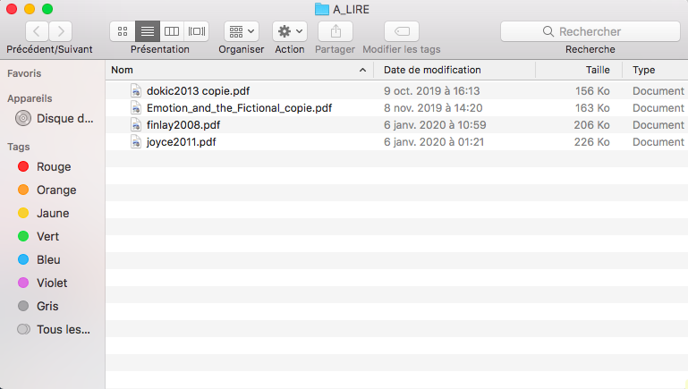
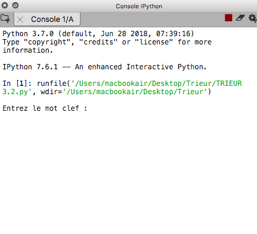
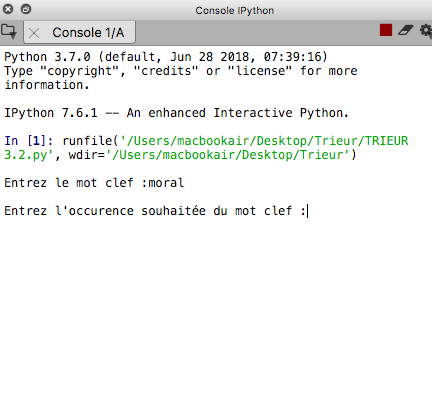
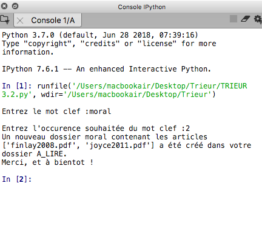
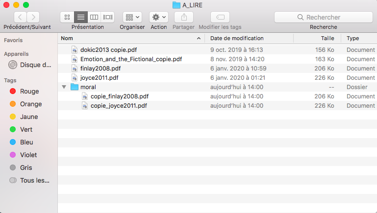

# Trieur d'article

## Introduction 
L'idée de ce programme m'est venue en constatant les conséquences de mon téléchargement compulsif d'articles que je n'ai en général pas le temps de lire.
En effet, au fur et à mesure, s'accumulent dans un dossier "à lire" des articles dont je n'ai plus aucune idée du contenu. 
Parfois cependant, lorsqu'un temps libre se présente devant moi ou qu'une soif de connaissance m'assailli à 2h du matin alors que je devrais dormir, il m'arrive d'ouvrir cette caverne d'Alibaba qu'est ce dossier "à lire". 
Le problème est le suivant : à ce moment précis, ma curiosité se restreint à une certaine gamme limité de thématiques. 
Pour trouver la perle rare correspondant à mes attentes parmis les inombrables articles du dossier, il est alors nécessaire d'ouvrir un par un les articles, d'en lire l'abstract jusqu'à ce qu'on trouve le bon. Une tâche ennuyeuse et rébarbative qui parfois (surtout à 2h du matin), me démotive finalement de la lecture. Automatiser celle ci s'est donc présenté très naturellement comme une nécessité. 

L'intérêt du programme que j'ai créé est donc de pouvoir y voir clair dans cet amoncellement d'articles qu'un cerveau paresseux n'a aucun intérêt à trier. Pour ce faire, l'idée était de générer au sein du dossier "à lire" des sous dossiers contenant tous les articles présentant dans leurs premiers 500 mots un occurence donnée (*n*) d'un mot clef donné (*x*). À partir de ces deux informations renseignées dans la console, le programme doit donc : 
1. Extraire le contenu textuel d'articles donnés au format pdf
2. Traiter ce contenu textuel pour qu'il soit analysable
3. Retenir les articles contenant *n* fois le mot *x* dans leurs 500 premiers mots 
4. Créer un dossier à partir des articles retenus

Une fonction a été créée pour chacune de ces tâches. J'expliquerais donc le fonctionnement de chacune d'entre elles avant de commenter les instructions, d'en donner un exemple d'utilisation et de conclure.

## 1) pdfparser
La majorité des articles scientifiques disponibles sur internet étant disponibles au format pdf, j'ai décidé de travailler à partir de ce format.
Une difficulté s'est rapidement présentée à moi. Les pdfs sont en effet des fichiers binaires et non pas des fichiers textes, ce qui a pour conséquence que leur contenu textuel n'est pas directement accessible. 

Pendant mes recherches, je suis tombé dans un forum (https://www.developpez.net/forums/d1599202/autres-langages/python/general-python/extraire-contenu-d-pdf-python/) sur ce message qui a failli me faire abandonner l'idée de travailler directement à partir du pdf : 

    "PDF is evil. Although it is called a PDF "document", it's nothing like Word or HTML document. PDF is 
    more like a graphic representation. PDF contents are just a bunch of instructions that tell how to place
    the stuff at each exact position on a display or paper. In most cases, it has no logical structure such 
    as sentences or paragraphs and it cannot adapt itself when the paper size changes. PDFMiner attempts to
    reconstruct some of those structures by guessing from its positioning, but there's nothing guaranteed to
    work. Ugly, I know. Again, PDF is evil."

Mon niveau en programmation ne me permettant pas de jouer avec le diable, mais ne voyant aucun intérêt à un programme qui m'obligerais à convertir préalablement les pdf en txt avec un convertisseur en ligne pour ensuite devoir routrouver les pdfs correspondant aux fichiers txt mis dans le dossier (autant lire les abstracts si c'est pour faire tout ça), j'ai finalement décidé de subtiliser une fonction trouvé sur un autre forum (https://stackoverflow.com/questions/25665/python-module-for-converting-pdf-to-text) que j'ai légèrement adapté afin de le rendre plus compréhensible.

La fonction se présente comme il suit : 
```
def pdfparser(article):
    #extrait le contenu textuel d'un pdf 
    fp = open(article, 'rb')
    manager = PDFResourceManager()
    retstr = io.StringIO()
    laparams = LAParams()
    device = TextConverter(manager, retstr, laparams=laparams)
    interpreter = PDFPageInterpreter(manager, device)
    for page in PDFPage.get_pages(fp):
        interpreter.process_page(page)
        texte_brut =  retstr.getvalue()
    return texte_brut
```
Pour faire simple, pdfparser ouvre un article dont on lui indique le path en argument, pour ensuite interpréter page par page le pdf et enfin retourner le texte brut. La fonction "TextConverter" permet ici de spécifier dans la fonction "PDFPageInterpreter" le mode d'interprétation des pages analysées, indiquant que l'on souhaite extraire le contenu textuel du pdf. Par ailleurs, l'objet retstr indique ici que l'on souhaite retourner une chaine de caractères (string). 

Pour être tout à fait honnête avec vous, le rôle des autres arguments nécessaires au fonctionnement de "TextConverter" (à savoir "manager" et "laparams") reste pour moi assez obscur. Peu d'informations sont en effet disponibles sur internet, à part des examples ne m'avançant pas à grand chose, ce qui a limité ma compréhension des fonctions de PDFMiner dans la limite du temps imparti. J'ai néanmoins préféré poursuivre avec une fonction plus ou moins obscure plutôt que de changer de projet. 

## 2) pre_traitement
Le contenu textuel extrait par pdfparser est un texte brut dont la structure ne permet pas encore le traitement souhaité. En effet, il présente : 
1. Des signes de ponctuation et d'autres symboles non alphabétiques. Ceux ci ne sont d’aucun intérêt pour la tâche qui nous occupe.
2. Des mots dont la certaines lettres sont en majuscule. Ces mots seront traités comme différents que leur version tout en minuscule, ce qui biaiserait la tâche que nus souhaitons accomplir. 
3. Le texte est présenté comme un bloc (une seule chaine de caractère ou string), alors que nous souhaitons cibler un mot en particulier.

Il est donc nécessaire de traiter le texte brut pour le transformer en une liste de mots (isolés les uns des autres comme différentes chaines de caractères contenus dans la liste) tout en minuscule et ne présentant aucun symbole non alphabétique. Pour ce faire, j’ai utilisé le package nltk (Natural Language Toolkit). 

La fonction se présente de la façon suivante : 
```
def pre_traitement(text) :
    #transforme le texte en liste de mots en minuscule
    tokenizer = nltk.tokenize.RegexpTokenizer("\w+")
    tokens = tokenizer.tokenize(text)
    words = []
    for word in tokens:
        words.append(word.lower())
    return words
```
Ici, la fonction "RegexpTokenizer" nous permet de désigner un mode de tokénisation du texte brut. Autrement dit, elle nous permet d'indiquer quelle règle sera suivie de façon systématique pour créer les sous chaines de caractères de la nouvelle liste sur la base du texte brut (qui on le rappelle, consiste en une seule et unique chaine de caractères). Ici l’argument "w+" permet d’indiquer que l’on ne retiendra que les mots, ce qui nous permet non seulement d'isoler les mots les uns des autres (chacun correspondant alors à une chaine de caractère), mais également de retirer les symboles non alphabétiques. En utilisant ce tokenizer que nous avons défini en appliquant au texte la méthode .tokenize() liée au tokenizer, nous pouvons alors créer une liste de mots isolés les uns des autres.

À ce stade, on obtient donc une liste contenant des mots dont certains peuvent toujours contenir des lettres majuscules. Pour palier à ce problème, j'ai créé une boucle for ajoutant grace à la méthode .append() à une liste vide ("words") les mots de la liste "tokens" mis en minuscule grace à la méthode .lower(). La fonction retourne alors une liste de mots tour en minuscule.

Une autre tâche classique de prétraitement de texte avec nltk consiste à retirer les stopwords, c'est à dire les mots courant tels que "ce", "un", "ou", qui ne sont pas porteurs de sens. Bien qu'ils ne soient pas utiles à notre tâche, il ne me semblait pas fondamentalement nécessaire de retier ces stopwords. De plus, je souhaitais que le programme puisse fonctionner autant sur des articles en anglais que sur des articles en français, ce qui aurait rendu compliqué la tâche si j'avais souhaité retirer les stopwords, puisqu'il aurait été nécessaire de détecter la langue afin de savoir quelle liste de stopwords utiliser, ou alors de retirer les stopwords des deux langues, ce qui pourrait potentiellement biaiser la tâche (par exemple si je cherche des articles en français sur le sens de l'agentivité dans le sport collectif et que j'ulitise le mot "but" comme mot clef, celui si serait retiré de la liste parce qu'il s'agit d'un stopword anglais). 

## 3) keyword_test
À partir de la liste de mots obtenue il est maintenant possible de rechercher la présence du mot clef demandé. Pour ce faire, j'ai créé la fonction keyword_test retournant une liste contenant les noms de tous les articles d'intérêts, c'est à dire des articles présentant le mot clef au moins le nombre souhaité de fois dans leurs 500 premiers mots. 

J'ai choisi de traiter les 500 premiers mots de l'articles et non pas l'ensemble du contenu textuel afin de traiter un nombre fixe de mots pour chaque articles (évitant ainsi de biaiser le résultat à cause de différences importantes dans la quantité de texte, un article de 30 pages ayant bien plus de chance de contenir un mot donné qu'un article de 3 pages) et pour traiter une liste de mot qui contient systématiquement l'abstract. 

De plus, plutôt que partir du texte traité, j'ai décidé d'inclure dans cette troisième fonction les deux fonctions définies précédemment, ce qui m'a évité de devoir remonter à l'article à partir de son contenu textuel. Le fait d'inclure les deux fonctions précédente m'a en effet permis de partir de la liste d'articles présents dans le dossier, ce qui facilite grandement la tâche. 

La fonction est alors définie comme il suit :
```
def keyword_test(liste_d_articles, key, nombre):
    #crée une liste contenant tous les acticles dont l'occurence du mot clef dans les 500 premiers mots est supérieure au         nombre souhaité 
    articles_recherchés = []
    compteur = 0
    for article in liste_d_articles :  
        texte_brut = pdfparser(article)
        texte_traité = pre_traitement(texte_brut)
        liste = texte_traité[0:500]
        for mot in  liste : 
            if mot == key :
                compteur = compteur + 1
                if compteur == nombre : 
                    articles_recherchés.append(article)
        compteur = 0
    return articles_recherchés
```
Cette fonction nécessite trois arguments : une liste contenant les noms de l'ensemble des articles à analyser (liste_d_articles), un mot clef (key, string), et une occurence souhaitée du mot clef (nombre, integer). 
Dans une première boucle for, keyword_test() appelle pour chaque article les fonctions pdfparser puis pre_traitement pour ensuite créer une liste contenant les 500 premiers mots du texte traité. Ensuite, cette liste est analysée dans une seconde boucle for. Pour chaque mot de la liste, cette dernière boucle teste sa correspondance avec le mot clef. Si le mot correspond, on ajoute +1 à un compteur définit précédement et initialisé à 0. Lorsque le compteur atteint le nombre recherché (compteur == nombre), on peut alors ajouter l'article analysé à la liste d'article recherchés (articles_recherchés) initialisée précédemment comme une liste vide, pour ensuite remettre le compteur à zéro, et recommencer le processus sur le prochain article de la liste, et ce jusqu'à ce que tous les articles aient été traités. 

## 4) create_final_folder
Grace à keyword_test(), on obtient donc une liste contenant les noms des  articles d'intérêt. À partir de là, il ne nous reste plus qu'à créer un dossier contenant ces articles. Pour ce faire, j'ai utilisé le module os qui permet très facilement les manipulations de fichiers et de dossiers. 

La fonction tient en 6 petites lignes : 
```
def create_final_folder(articles_recherchés):
    #crée un nouveau dossier dans le dossier A_LIRE contenant des copies des articles de la liste
    try :
        os.mkdir(keyword)
    except OSError :
        print(os.strerror(OSError.errno))
    for article in articles_recherchés:
        shutil.copy(article, keyword + "/" + "copie_" + article)
```
Avec la fonction "os.mkdir()", on crée un nouveau dossier portant le nom du mot clef dans le répertoire de travail. Ici "try :" et "except OSError :" nous permettent de ne créer un dossier que lorsque celui ci n'existe pas encore dans le répertoire de travail. Si par exemple j'ai déjà utilisé le programme pour trouver les articles contenant au moins 2 fois le mot "emotion" et que je réitère la même demande au programme, un message d'erreur s'affichera. 

Ensuite, j'ai créé une boucle for qui pour chaque article de la liste articles_recherchés va en créer une copie grâce à la fonction shutil.copy(), copie qui sera placée dans le dossier nouvellement créé. L'argument " keyword + "/" + "copie_" + article " correspond à une façon d'indiquer systématiquement le bon chemin relatif peu importe l'article et le mot clef. 

## 5) Instructions 
Il ne nous reste plus maintenant qu'à utiliser les trois fonctions définies. Avant celà, trois informations sont nécessaires. Il nous faut une liste contenant les noms des articles à traiter, un mot clef et une occurence du mot clef.

Plutôt que d'indiquer à chaque exécution le chemin absolu à suivre, j'ai décidé de l'indiquer dans le programme de manière systématique. Pour obtenir la liste des noms des articles à traiter, j'ai donc procédé de la façon suivante: 
```
path = "/Users/macbookair/Desktop/A_LIRE"
#chemin absolu vers le dossier contenant les articles au format .pdf

os.chdir(path)
#change le répertoire de travail, le dossier A_LIRE étant maintenant le répertoire de travail

liste_de_pdf = glob.glob("*.pdf")
#genère une liste contenant tous les noms des pdf du dossier
```
Je m'excuse par avance aux utilisateurs et utilisatrices de Windows et de Linux, mais j'ai indiqué ici un chemin absolu de mac. Si par chance vous avez comme moi le luxe de disposer d'un macbook air, il vous suffit de renommer votre dossier contenant vos articles "A_LIRE" et de le placer sur votre bureau. Si ce n'est pas le cas, le code n'est pas en tant que tel utilisable puisque le path ne correspond pas. Il faudra alors indiquer dans le programme le chemin absolu adéquat dirigeant vers le dossier, tout en prennant également soin de nommer ce dernier "A_LIRE". 

Lorsque c'est fait, la fonction "os.chdir()" appliquée au chemin absolu indiqué changera le répertoire de travail pour le dossier A_LIRE. Cela permet travailler facilement à l'intérieur du dossier sans à avoir à réindiquer systématiquement le chemin absolu. 

Ensuite, la fonction "glob.glob()" permet créer une liste contenant les fichiers de notre dossier A_LIRE tout en ne retenant que les fichiers pdf, graçe à l'argument ".pdf" (il manque l'étoile mais c'est juste que si je la mets ça fout tout le texte en l'air en le mettant en italique). Par ce moyen, tout fichier autre que pdf qui se serait malencontreusement glissé dans le dossier ne sera pas analysé. Ainsi, même si vous avez par mégarde ajouté au dossier une photo de votre chat ou le film que vous avez téléchargé illégalement hier soir, ces derniers ne feront pas bugger le programme puisque seuls les pdfs seront traités. 

Pour le mot clef et l'occurence de ce dernier, j'ai procédé de la façon suivante :
```
keyword = input("Entrez le mot clef :")
#demande le mot clef

occurence = int(input("Entrez l'occurence souhaitée du mot clef :"))
#demande l'occurence souhaitée du mot clef
```
La fonction input() permet ici de demander dans la console la valeur que l'on souhaite assigner à aux objets keyword et occurence, tout en imprimant les instructions (indiquées comme argument de input(), entre guillemets). En outre, la fonction int() permet simplement de transformer la chaine de caractère indiqué ("2" par exemple) en nombre entier (2), les valeurs entrées dans la console étant toujours des chaines de caractères. 

On a à ce stade toutes les valeurs nécessaires à l'exécution des fonctions définies plus tôt : 
```
articles_recherchés = keyword_test(liste_de_pdf, keyword, occurence)

create_final_folder(articles_recherchés)
```
On rappelle qu'on peut ici commencer directement par keyword_test() puisqu'elle utilise dans sa définition les fonctions pdfparser() et pre_traitement().

Pour terminer, j'ai simplement fait imprimer sur la console une petite phrase résumant la tâche qui vient d'être effectuée, et quelques mots de politesse pour rendre l'interface un peu plus chaleureuse : 
```
articles_dans_dossier = str(articles_recherchés)
print("Un nouveau dossier "+ keyword + " contenant les articles " + articles_dans_dossier + " a été créé dans votre dossier A_LIRE.")
print("Merci, et à bientot !")
```
L'utilisation de la fonction str() est ici nécessaire car une liste ne peut pas être concaténée à une chaine de caractères. Il est ainsi nécessaire de transformer la liste articles_recherchés en chaine de caractères. 

## 6) Exemple d'utilisation  
Pour tester le fonctionnement du programme, j'ai utilisé un faux dossier "A_LIRE" contenant quatre articles afin de m'éviter des temps de traitement trop long et afin de traiter uniquement des articles dont j'ai une bonne idée du contenu. Avant l'utilisation du programme, le dossier est comme il suit : 



Lorsqu'on exécute le programme, une première instruction apparait comme prévu dans la console : 



Ici, j'ai choisi d'utiliser le mot "moral" comme mot clef afin de trouver les articles traitant de la moralité. Le mot clef doit être écrit sans guillemets et sans espace. On peut ensuite appuyer sur entrée pour valider l'information. Dès lors, une deuxième instruction s'affiche :  



J'ai choisi ici une occurence de 2. Une occurence de 1 peut en effet parfois biaiser le résultat, certains articles pouvant utiliser le mot clef dans leurs 500 premiers mots sans pour autant qu'il s'agisse réellement d'un mot important du texte (par exemple ici dans "the moral of this story" par exemple). Lorsqu'on appuie à nouveau sur entrée, le programme exécute la tâche. Au bout d'une quinzaine de secondes, un dernier message nous indique la création d'un nouveau dossier contenant deux des articles :



Lorsqu'on réouvre notre dossier "A_LIRE", on trouve effectivement un nouveau dossier nommé "moral" dans lequel se trouve les copies des deux articles en question : 



Dans cet exemple, le trieur fonctionne parfaitement, les deux articles sélectionnés par le programme parlant en effet de méta-éthique, tandis que les deux autres parlent de philosophie des émotions. 

## Conclusion
Bien qu'étant assez satisfait d'avoir réussi à construire un programme fonctionnel en partant de zéro en programmation et sans avoir eu à raboter mon projet, il est important d'évoquer ici ses limites. 

Tout d'abord, le programme est assez lent. Dans l'exemple précédent, pour lequel nous ne traitions que quatre articles, le temps d'exécution était d'environ 15 secondes. À ce rythme là, traiter une cinquantaine d'article pourrait prendre presque trois minutes. Plusieurs tâches auraient pu être optimisées afin de pallier à ce problème. Tout d'abord, il aurait été peut être plus intelligent de retenir les 500 premiers mots en amont. Ici en effet, pdfparser() et pre_traitement() traitent l'ensemble du contenu textuel, alors que seul les 500 premiers mots sont nécessaires. De plus, dans la fonction pre_traitement(), la méthode .lower() est appliquée à l'ensemble des mots de la liste, alors que seuls les mots en majuscule sont d'intérêt ici. L'emploi d'une boucle if aurait donc été plus judicieux. 

Par ailleurs, une autre étape de pré-traitement du texte aurait été nécessaire. Pour le dosssier donné dans l'exemple, lorsque j'indique en mot clef le mot "emotion" seul un article est inclu dans le dossier, alors que deux traitent des émotions. En effet, un des deux articles en question n'emploie le terme qu'au pluriel ("emotions"), ce dernier étant traité comme différent de sa version au singulier. Il aurait été ainsi judicieux d'ajouter une étape à la fonction pre_traitement() permettant le retrait des "s" à la fin des mots au pluriel. 

On peut également noter le fait que le programme crée un dossier vide lorsqu'aucun article ne correspond aux critères. On aurait pu ici utiliser create_final_folder() dans une boucle if afin d'éviter ce problème. 

Enfin vous l'aurez remarqué j'ai défini assez égoïstement le chemin absolu, de telle sorte que le programme n'est pas directement utilisable en dehors du cercle restreint des propriétaires d'un macbook air. Il aurait pour cela été plus judicieux d'également demander le chemin absolu dans la console. 

Faute de temps, je n'ai pas pu régler ces quelques problèmes. Reste que le programme est fonctionnel et utile à toute personne dont le dossier A_LIRE ressemble au logement d'une personne agée atteinte du syndrome de Diogène. 
